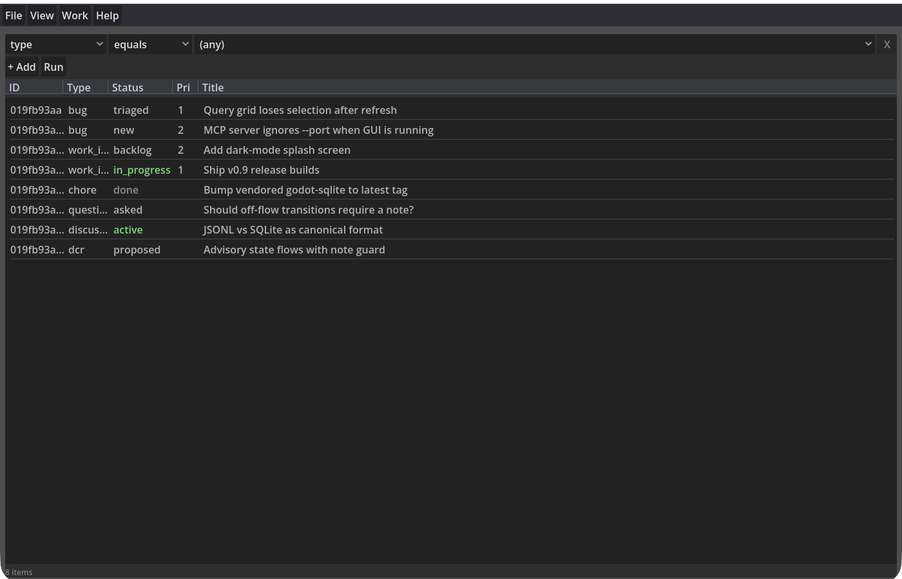
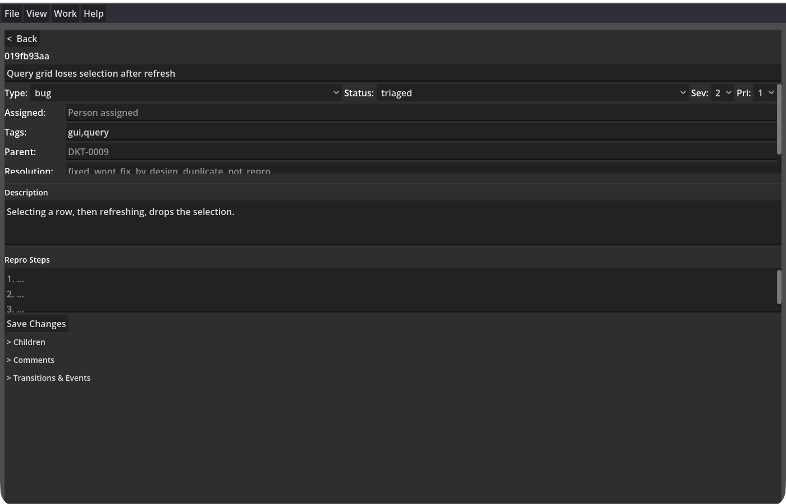

# Docket

[](https://github.com/imrans-lab/docket/actions/workflows/ci.yml)
[](LICENSE)

**Docket is a work-item tracker built for LLM agents and humans working
together.** Your coding agent files bugs, updates work items, and records what
it learned over MCP; you see the same project live in a desktop GUI. The data
is plain text in your git repo — no server, no account, no lock-in.



## Why Docket

- **One tracker, two audiences.** The GUI and the MCP server run on the same
  file at the same time. An agent closes a bug; you watch it happen.
- **Agents that remember.** Beyond bugs and work items, Docket has knowledge
  types — hints, insights, skills, prompts, policies — so agents can learn, collaborate,
  and share.
- **Git-native storage.** A project is a single `.dct` file of line-oriented
  JSON: diffable, mergeable, reviewable in a pull request. Branch your tracker
  with your code.
- **Local-first and private.** Everything lives in your repo. Supports secrets and
  encrypted notes. Optional double encryption for items you deem extra-sensitive.
- **Structured, not bureaucratic.** Fourteen item types with state
  flows.
- **Fast and shareable queries.** A visual query builder with AND/OR logic and wildcards,
  backed by an automatic SQLite cache. Save queries as `.dcq` files and share
  them. Load several projects at once and query across them.

## Install and launch

Download the build for your platform from the
[Releases page](https://github.com/imrans-lab/docket/releases):

- **macOS** — open the `.app`; right-click → *Open* on first launch (ad-hoc
  signed, not notarized).
- **Windows** — run `Docket.exe`; SmartScreen will warn: *More info* → *Run
  anyway*.
- **Linux** — extract and run `./docket.x86_64`.

Launching the app opens the GUI **and** starts the MCP server (port 3010), so
there is nothing else to set up. Use **File > New Docket** to create a
project, or open [`examples/demo.dct`](examples/demo.dct) from this repo to
poke at sample data.

To run the server headless (no window):

```bash
# macOS path shown; use ./docket.x86_64 or Docket.exe elsewhere
/Applications/Docket.app/Contents/MacOS/Docket --headless -- serve --port 3010 --file myproject.dct
```

Release checksums are GPG-signed — see
[README-agents.md](README-agents.md#install) for verification.

## Register as an MCP tool

The server speaks JSON-RPC 2.0 over HTTP at `http://127.0.0.1:3010/mcp`.
Start Docket first, then register it once:

**Claude Code**

```bash
claude mcp add --transport http docket http://127.0.0.1:3010/mcp
```

or in your project's `.mcp.json`:

```json
{
  "mcpServers": {
    "docket": { "type": "http", "url": "http://127.0.0.1:3010/mcp" }
  }
}
```

**Codex CLI** — in `~/.codex/config.toml`:

```toml
[mcp_servers.docket]
url = "http://127.0.0.1:3010/mcp"
```

(Older Codex builds support only stdio servers; if `url` is rejected, update
Codex or enable its streamable-HTTP client option.)

The endpoint binds to loopback only and refuses browser-originated requests;
details in [README-agents.md](README-agents.md#what-the-endpoint-accepts).

## What it looks like in a session

Once registered, work items come up naturally in conversation:

> **You:** While you're in there — file a bug about the query grid losing its
> selection after a refresh.
>
> **Agent:** Filed `019fb93a` *Query grid loses selection after refresh*
> (bug, new, priority 1, tagged `gui`, `query`).

> **You:** What's on my plate?
>
> **Agent:** *(queries status ≠ done)* Two open bugs, one work item in
> progress — "Ship v0.9 release builds" — and a question awaiting an answer:
> "Should off-flow transitions require a note?"

> **You:** The sqlite bump chore is already done, we did it during the 4.6.3
> upgrade. Close it.
>
> **Agent:** Done — moved it straight to `done` with the note "already bumped
> as part of the 4.6.3 upgrade" since that skips the normal flow.

Agents also record what they learn as they work — a hint about the flag that
finally worked, an insight about an assumption that proved wrong — and pull
those back with `docket_context` before starting related work. The full tool
list is in [README-agents.md](README-agents.md#mcp-tools).

## Screenshots

The query view — condition rows over a live results table:


An item opened in the detail form — fields, description, comments, and the
full transition history:



## Going deeper

[README-agents.md](README-agents.md) has the full reference: architecture,
data format, CLI, every MCP tool, item types and state flows, the vault,
concurrent access, and building from source.

## License

[MPL-2.0](LICENSE) — embed it freely; publish changes to Docket's own files.
Copyright (c) 2026 Imran Peerbhai.
